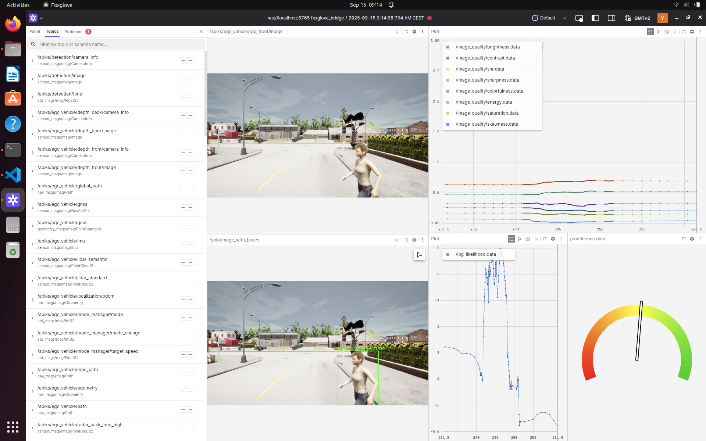

<!--
SPDX-FileCopyrightText: 2026 German Aerospace Center (DLR e.V.) <https://dlr.de>

SPDX-License-Identifier: MIT
-->

# Information Quality Monitoring

A design strategy for AI-based systems in automated driving that can deal with poor-quality input data without resorting to fallback solutions. Perception is one of the primary applications where neural networks outperform conventional algorithms — for example, AI systems that detect pedestrians from image data. A substantial challenge is that the output of these AI systems depends heavily on the quality of the input images. Heavy contamination such as noise, darkness, or optical artefacts can make accurate predictions infeasible.

This project estimates the quality of incoming images by comparing them to the training distribution using **normalizing flows** (Real NVP). When image quality is low, the system enters a fail-degraded mode: the object detector's confidence threshold is lowered, allowing it to detect objects more cautiously in uncertain situations.



---

## Repository Structure

```text
information-quality-monitor/
├── datasets/               # Dataset configuration files (YAML)
├── features/               # Pre-extracted feature CSVs and merge utility
├── network_logs/           # Trained normalizing flow models (one folder per run)
│   └── train_<model_id>/   # Timestamped training run
│       ├── normalizing_flow_model.pth
│       ├── training_progress.png
│       └── losses.json
├── ood_data/
│   ├── images/             # Input images for OOD analysis
│   └── results/            # OOD detection output CSVs
├── show/                   # Demo images / documentation assets
├── src/infqm/
│   ├── api/                # Flask REST API (app.py, templates, static)
│   ├── kpi_num/            # Hand-crafted image quality metrics (brightness,
│   │                       #   contrast, sharpness, SNR, …)
│   ├── normalizing_flow/
│   │   ├── train.py        # Real NVP model definition and training loop
│   │   ├── eval.py         # Evaluator: load model and score new images
│   │   ├── logger.py       # Training logger – writes to network_logs/
│   │   ├── generate_training_data.py  # Extract features from a dataset
│   │   ├── image_loader.py # PyTorch dataset wrappers
│   │   ├── plot_training.py# Plot loss curves from a training run
│   │   └── ood_detection/  # Scripts for OOD experiments and visualisation
│   ├── object_detector/    # FCOS object detector integration
│   ├── unreal/             # Unreal Engine / ROS bridge (C++ + Python)
│   ├── base_metric.py      # Abstract base class for image quality metrics
│   ├── datasets.py         # Dataset loader (reads datasets/*.yaml)
│   └── main.py             # ROS2 node: subscribes to image topic, publishes scores
├── tests/                  # pytest test suite
├── utils/                  # Matplotlib style sheet
├── config.env              # Runtime configuration (ROS topic, model_id)
├── docker-compose.yaml     # Docker Compose for the full ROS2 toolchain
├── Dockerfile
├── Makefile                # Convenience targets (run, fcos, test, …)
└── pyproject.toml          # Project metadata and tool configuration
```

---

## Requirements

- **Python** 3.10 (exact version required)
- **ROS2 Humble** (for the ROS node in `main.py`; not needed for training/evaluation)
- **CUDA 11.8** recommended for GPU-accelerated training (CPU fallback is supported)

Python dependencies (managed by [uv](https://docs.astral.sh/uv/)):

| Package                  | Purpose                                 |
|--------------------------|-----------------------------------------|
| `torch` / `torchvision`  | Normalizing flow model, dataset loading |
| `opencv-python`          | Image I/O and preprocessing             |
| `numpy` / `pandas`       | Numerical computation and data handling |
| `scikit-learn`           | Feature scaling                         |
| `matplotlib` / `seaborn` | Plotting training curves and results    |
| `flask` / `flasgger`     | REST API                                |
| `tqdm`                   | Progress bars                           |

All dependencies are pinned in `uv.lock`. See `pyproject.toml` for the full specification.

---

## Installation

### 1. Install uv

```bash
pip install uv
```

### 2. Clone and install the project

```bash
git clone https://github.com/DLR-KI/information-quality-monitor
cd information-quality-monitor
uv sync
```

This creates a virtual environment and installs all dependencies (including CUDA-enabled PyTorch on Linux/Windows).

---

## Docker (dev container for the ROS2 toolchain)

A `Dockerfile` and `docker-compose.yaml` are provided so you can run the complete ROS2 toolchain without installing ROS2 on the host. The image is based on `ros:humble` and includes `cv_bridge` and all Python dependencies.

### Build and start

```bash
make docker
# equivalent to: docker compose up --build
```

This builds the image and starts the `ros2` service, which automatically runs the image quality monitoring node (`src/infqm/main.py`) inside the container.

### How it works

The container is configured to communicate with other ROS2 nodes running on the **host machine** via shared networking:

| `docker-compose.yaml` setting | Purpose                                                                                              |
|-------------------------------|------------------------------------------------------------------------------------------------------|
| `network_mode: host`          | Shares the host network stack — required for ROS2 DDS multicast to reach nodes outside the container |
| `ipc: host`                   | Enables shared-memory DDS transport between container and host                                       |
| `ROS_DOMAIN_ID=0`             | Must match the `ROS_DOMAIN_ID` set on the host                                                       |
| `env_file: config.env`        | Injects `INPUT_TOPIC` and `model_id` into the container at runtime                                   |

### Typical workflow

1. Set your `model_id` and `INPUT_TOPIC` in `config.env`.
2. Start the quality monitor inside the container:

    ```bash
    make docker
    ```

3. On the **host**, start the object detector and camera stream as usual:

    ```bash
    make fcos   # FCOS object detector (fail-degraded mode)
    make test   # webcam publisher
    ```

    Because the container uses `network_mode: host`, all ROS2 topics are visible to both sides without any extra bridging.

---

## Usage

### Step 1 — Configure a dataset

Create a dataset configuration file in `datasets/`, e.g. `datasets/my_dataset.yaml`:

```yaml
name: my_dataset
train:
  data: <PATH_TO_TRAINING_IMAGES>
  labels: <PATH_TO_LABEL_FILES>
test:
  data:
  labels:
val:
  data:
  labels:
```

If no train/test/val split exists, a random split is drawn automatically.

### Step 2 — Extract training features

```python
# in src/infqm/normalizing_flow/generate_training_data.py
if __name__ == "__main__":
    Z = FeatureLoader("my_dataset")
    Z.create_features(handcraftet=True)
```

Run with:

```bash
uv run python src/infqm/normalizing_flow/generate_training_data.py
```

### Step 3 — Train the normalizing flow

```python
# in src/infqm/normalizing_flow/train.py
def main() -> None:
    train_normalizing_flow(dataset_name="my_dataset")
```

Run with:

```bash
uv run python src/infqm/normalizing_flow/train.py
```

After training, a timestamped folder appears in `network_logs/`, e.g. `network_logs/train_20260101_120000/`. It contains:

- `normalizing_flow_model.pth` — saved model weights (best validation loss)
- `training_progress.png` — loss curve plot
- `losses.json` — raw train/val losses per epoch
- `_script.py` / `logger.py` — snapshot of the scripts used for this run

Note the `<model_id>` part (e.g. `20260101_120000`).

### Step 4 — Configure the model ID

Set the model ID in `config.env`:

```ini
model_id=20260101_120000
```

### Step 5 — Run the ROS2 toolchain

Make sure ROS2 Humble is installed, then:

```bash
# Start the image quality monitoring node
make run

# Start the FCOS object detector (fail-degraded mode)
make fcos

# Stream from webcam
make test
```

---

## REST API

A standalone Flask API is provided for use without ROS2:

```bash
uv run python src/infqm/api/app.py
```

API documentation is served via Flasgger at `http://localhost:5000/apidocs`.

---

## OOD Analysis

The `src/infqm/normalizing_flow/ood_detection/` directory contains scripts for out-of-distribution experiments:

- `perturbations.py` — Sweep augmentation parameters (noise, blur, darkness, lens flare, rolling shutter) and record how the log-likelihood changes.
- `test_images.py` — Score a full dataset and write results to `ood_data/results/`.
- `violin_plots.py` / `comparison_latent_features.py` — Visualise and compare results.

---

## Citation

If you use this software in your research, please cite it using the metadata in [`CITATION.cff`](CITATION.cff):

```bibtex
@software{kees_information_quality_monitor,
  author       = {Kees, Yannick},
  title        = {Information Quality Monitor},
  version      = {1.0.0},
  date         = {2025-12-19},
  url          = {https://github.com/DLR-KI/information-quality-monitor},
  keywords     = {DLR, Safe AI Engineering, Monitoring, Image Quality, ROS2}
}
```

For the machine-readable citation, see [`CITATION.cff`](CITATION.cff) which follows the [Citation File Format](https://citation-file-format.github.io/) standard.

---

## License

The source code is licensed under the **MIT License** — see [`LICENSES/MIT.txt`](LICENSES/MIT.txt).

Trained model weights (`*.pth`) are released into the public domain.

Demo and documentation images (`show/`) are licensed under [CC-BY-NC-ND-3.0](LICENSES/CC-BY-NC-ND-3.0.txt).

The `config.env` configuration file is licensed under [CC-BY-SA-4.0](LICENSES/CC-BY-SA-4.0.txt).

This project follows the [REUSE specification](https://reuse.software/) — every file carries its own SPDX licence header or is covered by `REUSE.toml`.
